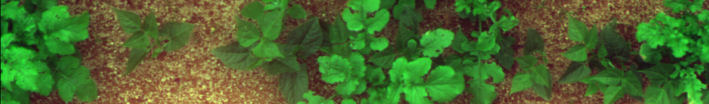

# Thèse de doctorat en Informatique

## Approche multicritère pour la caractérisation des adventices

Cette thèse, c'est déroulé à l'UMR Agroécologie de Dijon au sein de l'équipe agriculture de précision et affilié à L'INRAE, AgroSupDijon, UFBC et l'école doctoral E2S (Environnement Santé). D'autres partenaires sont également présents, tel qu'IWMPRAISE, l'ANR Challenge RoSE ou encore l'entreprise SITIA. L'objectif principal était de déterminer les critères les plus discriminants afin de classer des individus (ammats / plantes / feuilles / pixels) à partir d'images entre cultures et adventices.

Ces critères se regroupent en trois familles :
- Critères spatiaux, qui utilisent des notions de distances
- Critères de formes, extrait à partir du contour des individus
- Critères de couleurs/spectres/textures issue d'une caractérisation de la distrubution spatial des couleurs.

# Résumé
L'objectif de cette thèse est de mettre au point un moyen de détecter les adventices dans un champ à l'aide d'images multispectrales, afin de pouvoir déterminer quelles sont les adventices à éliminer pendant le cycle de culture en cours et plus particulièrement aux stades précoces. L'approche multi-critère s'intéresse à la disposition spatiale, à la signature spectrale, à la morphologie et à la texture des plantes présentes dans les parcelles. Ce manuscrit propose une méthode permettant de sélectionner les meilleurs critères pour une discrimination optimale dans un contexte donné. Préalablement, à l'extraction de ces critères, un ensemble de méthodes ont été développées afin de corriger les erreurs du dispositif d'acquisition, de détecter précisément la végétation, puis d'identifier au sein de la végétation les individus sur lesquels les différents critères peuvent être extraits. Pour l'étape de détection des individus, il s'est révélé que l'échelle de la feuille était plus adaptée que celle de la plante. La détection de la végétation et l'identification des feuilles s'appuient sur des méthodes d'apprentissage profond, capables de traiter des feuillages denses. L'introduction de ces méthodes dans une chaîne de traitement usuelle constitue l'originalité de ce manuscrit où chaque partie a fait l'objet d'un article. Concernant le dispositif d'acquisition, une méthode de recalage des bandes spectrales a été développée, et les résultats montrent une précision de l'ordre du pixel. Ensuite, de nouveaux indices de végétation reposant sur de l'intelligence artificielle constituent l'une des avancées scientifiques de cette thèse. À titre indicatif, ces indices permettent d'atteindre 82.19% de mIoU contre 63.93%-73.71% pour des indices standards et fonctionnent en environnement non-contrôlé. Par extension, une méthode de détection des feuilles a été définie. Elle repose sur la détection de leurs contours, et semble avantageuse sur nos données multispectrales. Finalement, les meilleurs couples de propriétés ont été définis pour la discrimination culture/adventices à l'échelle de la feuille, dont les performances atteignent 91% de classification.

## Cadre / Context
Cette thèse s'est déroulée dans un cadre d'agriculture dite conventionnelle. Et plus particulièrement afin de lutter contre les pratiques intensives et leurs conséquences environnementales. Par exemple, les labours, le tassement et compactages des sols ou l'utilisation d'intrants (engrais, produit phytosanitaires, ...). Cette thèse s'insère donc dans ce cadre à travers l'utilisation de nouvelles technologies et de robotique agricole. À cette fin, l'ANR Challenge RoSE a eu pour objectif la mise en place de parcelles expérimentales et l'organisation de rencontre et de challenge afin de mesurer l'avancer technologique de différents consortiums, dont le nôtre. L'évaluation est divisée en quatre tâches :

- Détection : Ou sont les plantes ?
- Interprétation : Est-ce une culture ou une adventice ?
- Décision : Faut-t'il traiter ?
- Action : Comment traité ?

L'entreprise SITIA, c'est focalisé sur les tâches de décision et d'action. Cette thèse a été dédiée aux taches de détection et d'interprétation. Si l'objectif principal de cette thèse est de définir les meilleurs critères pour une discrimination culture/adventice, donc la tâche d'interprétation. On comprend ici que la tâche de détection est également nécessaire et essentiel en préambule.

## Réalisations
Pour réaliser l'ensemble des tâches, deux grands axes sont possibles. Soit une approche standard reposant sur des algorithmes et de la création d'une chaîne de traitement (pré-traitement, Indices de végétation, Segmentation, ...) mais généralement sous-optimal (performances/temps). Soit une approche apprentissage profond, reposant sur des réseaux de neurones, généralement optimal (temps/performances) mais considéré comme difficilement interprétable. Ces deux grands axes ont des inconvénients et des points forts. L'originalité de cette thèse consiste en l'utilisation des deux méthodes. Une chaîne de traitement standard a été définie, mais chaque étape a été optimisée, soit par des hyper-paramètres, soit par apprentissage profond. Ces travaux ont mené à la création de quatre publications :

- Two-step multi-spectral registration via key-point detector and gradient similarity. Application to agronomic scenes for proxy-sensing (publié) -> https://gitlab.com/phd-thesis-adventice/phd-airphen-alignment
- DeepIndices : A new approach to remote sensing indices based on optimization and approximation of functions through deep-learning, with application to vegetation surfaces over uncalibrated data (publié) -> https://gitlab.com/phd-thesis-adventice/codes/phd-index-optimizer
- Pixelwise Instance Segmentation Of Leaves In Dense Foliage (in review) -> https://gitlab.com/phd-thesis-adventice/codes/phd-segmentation-optimizer
- Weed discrimination at leaf scale : towards the characterization of the vegetation  cover : A large comparison of shape, spatial and textural features (in review) -> https://gitlab.com/phd-thesis-adventice/codes/phd-leaf-features

## Manuscrit
Ce repository contient le manuscrit de thèse au format latex/tikz et une version compilée est disponible sur TEL.

- Tout d'abord un **préambule** présente brièvement le cadre général, les différents partenaires, les objectifs de la thèse, ainsi que le contexte de cette dernière.
- Un chapitre **introduction** présente le cadre plus en profondeur, notamment les problématiques agricoles et leurs conséquences environnementales. Une présentation de l'agriculture de précision qui est étudiée à l'UMR Agroécologie est faite pour démontrer qu'elle présente un des axes de levier face aux enjeux environnementaux. Finalement, les problématiques liées au désherbage sont discutées avec une présentation des méthodes "actuelles" et "en cours de développement".
- Dans l'introduction, nous avons vu que la robotique et la vision par ordinateur sont un axe de recherche possible dont cette thèse est focalisée sur ces méthodes. Ainsi, un état de l'art assez conséquent est proposé dans ce chapitre **Vision par ordinateur** pour donnée au lecteur une vue globale de la discipline. À la fin de ce chapitre, une conclusion permet de comprendre les choix qui ont été faits durant cette thèse.
- Le chapitre suivant, **matériel et données** introduit simplement la caméra multi-spectrale qui a été utiliser. Le choix des bandes spectrales à été défini par une étude antérieure au sein de ce laboratoire. Pour évaluer nos différents algorithmes, deux parcelles expérimentales ont été utilisées. L'une à AgroSup Dijon, l'autre à l'INRAE de Montoldre. Les différentes corrections "simples" liées aux matériels sont également expliquées ici.
- Les quatre chapitres suivants introduisent les quatre articles issus des travaux de cette thèse. (défini plus haut).
- Finalement, une conclusion et des perspectives sont proposées au vu des résultats de cette thèse.

Bonne lecture